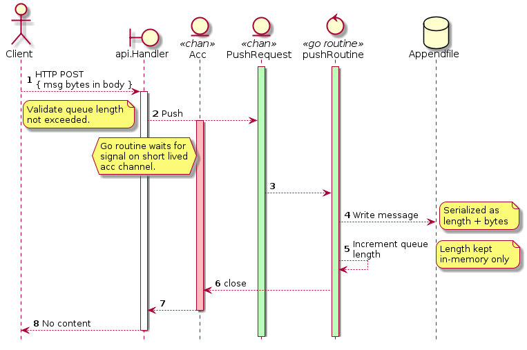

***Pinkfoot*** is a simple message queue service implemented in Go.
It is persisted and guarrantees _at least once_ delivery.
Pinkfoot is part of the ***Eightlegs project***, and is named after Theraphosa apophysis - also called the pinkfoot goliath.

Pinkfoot is NOT production ready!!!

## Configure and run

Pinkfoot requires exactly one command line argument, which is the path to a TOML configuration file. See the complete configuration file in the repository for details on what can be configured.

## Usage

### Push

You push messages using HTTP POST. Given that Pinkfoot is listening to localhost:3000, do this:

```
$ curl http://localhost:3000 \
     -d "This is a test" \
     -vvv

...
< HTTP/1.1 204 No Content
...
```

### Pop & acknowledge

You pop messages using HTTP GET. You also need to acknowledge receipt of the message using an HTTP PUT, or the message will be re-inserted into the queue after some time.

```
$ curl http://localhost:3000 -vvv

...
< HTTP/1.1 200 OK
< X-Correlation-Id: 765b1407-9bce-43f5-ab53-be8fb9351ea1
...
This is a test

$ curl http://localhost:3000 \
       -X PUT \
       -H "X-Correlation-Id: 765b1407-9bce-43f5-ab53-be8fb9351ea1" \
       -vvv

...
< HTTP/1.1 204 No Content
...
```

## Sequence diagrams

